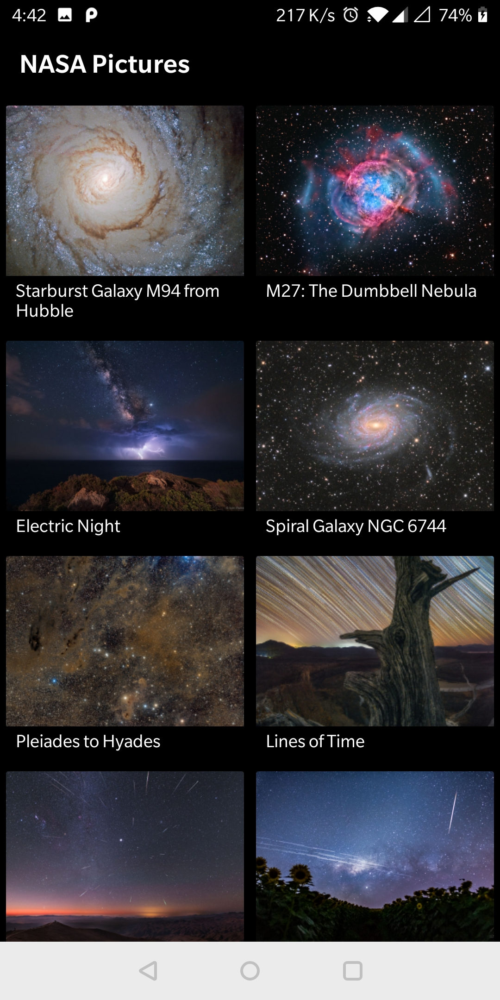
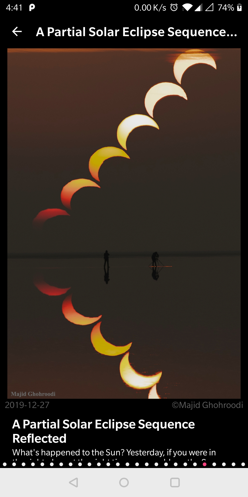

# NASA Pictures App
NASA Pictures App is an Android Application to browse through a list of serene images captured by NASA.
 NASA Pictures App can:

1. Display latest NASA pictures in a grid sorted by date
2. Show details of the image including copyrights, in depth explanation and a High Definition version of the image
3. High Definition image can be zoomed in and out by pinch-in, pinch-out respectively
4. Image can also be zoomed in and out by double taps
5. Swiping to the right (and left) will show the details of next and previous image
6. User can jump to a certain position by using the tab selector at the bottom of Picture Details screen

## Screenshots

## Libraries Used

* AppCompat, CardView, RecyclerView, PhotoView as Design Library
* Glide
* Lifecycle
* Material 
* Gson
* Espresso
* Junit

## Architecture

### MVVM
MVVM stands for Model, View, ViewModel. MVVM facilitates a separation of development of the graphical user interface from development of the business logic or back-end logic (the data model). 

#### Model
Model holds the data of the application. Model represents domain specific data and business logic in MVC architecture. It maintains the data of the application. Model objects retrieve and store model state in the persistance store like a database. Model class holds data in public properties. It cannot directly talk to the View.
#### View
Viewrepresents the UI of the application devoid of any Application Logic. It observes the ViewModel.
#### ViewModel
ViewModel acts as a link between the Model and the View. It’s responsible for transforming the data from the Model. It provides data streams to the View. It also uses hooks or callbacks to update the View. It’ll ask for the data from the Model.
The following flow illustrates the core MVVM Pattern.

## MVVM implementation in app
<b>Model</b> `PictureDetails` implements Serializable and holds the data for a NASA Picture like Title, Date, Description, Copyright, Media type, Service Verison and Image Url.

<b>Repository</b> `PhotosRepository` has following purpose:
- `loadJSONFromAsset()` to load read data.json Android Asset file that consists of NASA Pictures data
- `getPhotosData()` to get Mutable LiveData of List of `PhotoDetails` objects
- `setPhotosData()` to fetch json string from `loadJSONFromAsset()` and read it to create a dataset of PhotoDetails

<b>ViewModel</b> `PhotosGridActivityViewModel` is a class designed to hold and manage UI-related data in a lifecycle conscious way. `PicturesGridActivityViewModel` will support `PicturesGridActivity` and hold UI related data for it like `getPicturesDetails()`. PhotosGridActivityViewModel is a lifecycle-aware and it allows data to survive configuration changes such as screen rotation.

<b>View</b> `PicturesGridActivity` uses `initPicturesGridModelView()` method to interact with ViewModel to get Picture Details and observe them for any changes.
PicturesGridActivity uses `initRecyclerView()` method to initialize pictures grid recycler view to show NASA picture image and image name by PicturesGridRecyclerAdapter with GridLayout of two items in a row.
Android activity layout `activity_pictures_grid.xml` has custom toolbar and RecyclerView for pictures grid.

<b>View</b> `PictureDetailsActivity` includes picturesViewPager for horizontal scrolling view pager to show NASA pictures. This activity has UI for NASA picture zoomable image, date, copyright, title, explanation and tab selector to move across images.

### Apdaters
RecyclerViewAdapter `PicturesGridRecyclerAdapter` provides a binding for NASA Picture image and name, set to views that are displayed within the recyclerView for the PicturesGridActivity, i.e, Pictures grid screen. Images will be load using Glide will CircularProgressDrawable as placeholder and sad icon for image loading error. Glide is used for a fast image loading and caching.
RecyclerView is an efficient version of ListView which acts as a container for rendering data set of views that can be recycled and scrolled efficiently.

PagerAdapter `PictureDetailsViewPagerAdapter` inflates picture details data including picture, title, explanation, date and copyright in the picture details item and keeps it updated with the horizontal scroll for next and previous pictures.

## Testing
### Espresso 
Espresso is a testing framework for reliable Android User Interface tests.
Espresso synchronizes test actions with the application interface and ensures that activity is started before testing.

`PicturesGridActivityTest` performs User Interface tests using Espresso framework.
It uses `fetchPicturesDataToBeTested()` helper method to fetch data from `PicturesGridActivityViewModel` before testing.
- TestPicturesGridActivityInView tests the current activity, i.e., `PicturesGridActivity`.
- TestPicturesGridRecyclerViewVisible tests the visibility of recyclerView for Pictures grid.
- TestPicturesGridRecyclerViewSwipeDown tests recyclerView scrolling function by scrolling down to a particular position.
- TestPicturesGridRecyclerViewNavigate tests navigation to `PictureDetailsActivity` on click of a recyclerView pictures grid item.

`PictureDetailsActivity` performs User Interface tests on second activity using Espresso framework.
It uses `fetchPicturesDataToBeTested()` helper method to fetch data from `PicturesGridActivityViewModel` and navigate to `PictureDetailsActivity` before testing.
- TestPictureDetailsActivityInView tests the current activity, i.e., `PictureDetailsActivity`.
- TestPictureDetailsViewPagerVisible tests the visibility of picture details viewPager for swiping pictures.
- TestPictureDetailsTabSelectorVisible tests the visibility of picture details tabSelector for selecting different pictures.
- TestNavigatePictureDetailsAndSwipeRight tests Picture Details viewPager scrolling function by swiping to right picture.
- TestNavigatePictureDetailsAndSwipeLeft tests Picture Details viewPager scrolling function by swiping to left picture.
- TestNavigatePictureDetailsAndPressBack tests navigation to PictureDetailsActivity on click of a recyclerView pictures gridItem and going back to GridActivity on back button press.
- TestNavigatePictureDetailsAndSwipeDown tests swiping down to see Picture Description

### Junit
`PicturesGridActivityViewModelTest` has Unit test case to fetch data from testData json asset and verify it with pictureDetails test data.

Developed By
------------

* Vatsal Yadav  - www.linkedin.com/in/vatsalyadav 
